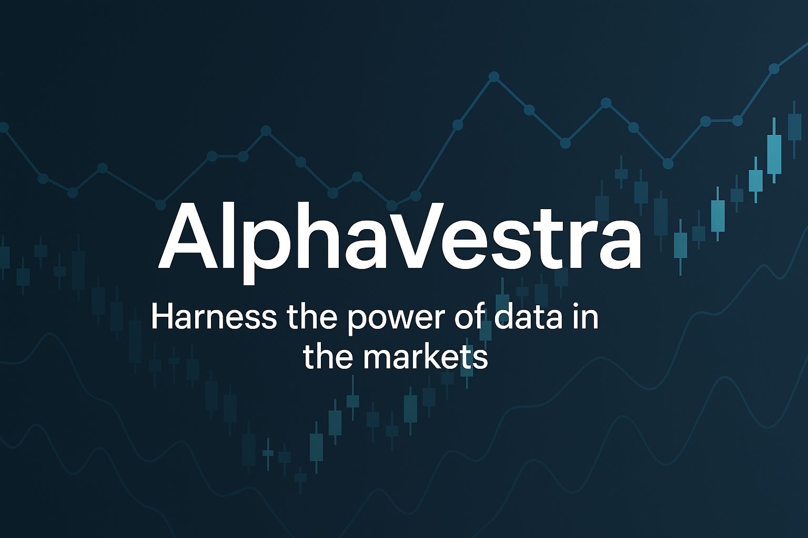

# AlphaVestra

An AI-powered tool for analyzing individual stocks and generating trading suggestions based on historical data and technical indicators.



## Features
- Rule-based strategies (moving averages, RSI, etc.)
- Machine Learning predictions using XGBoost
- Backtesting with performance metrics
- Simple UI for daily trade suggestions

## Project Structure
- `notebooks/`: Analysis and prototyping
- `src/`: Modular and reusable code
- `data/`: Historical stock data (downloaded with `yfinance`)
- `models/`: Saved ML models
- `interface/`: Front-end for displaying suggestions

## Setup
```bash
pip install -r requirements.txt
